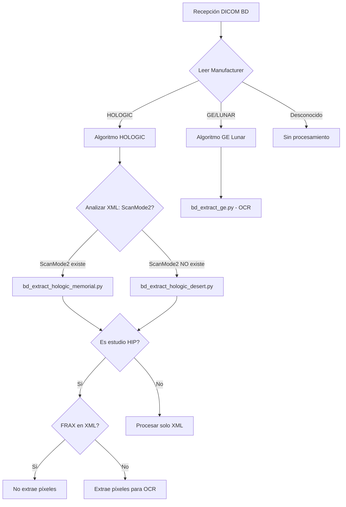

# Criterios de Selección de Algoritmos BD (Bone Density)

## 📋 Resumen Ejecutivo

El sistema DICOMReceiver implementa un **proceso de decisión automático** para seleccionar el algoritmo de procesamiento correcto para estudios de densitometría ósea (BD). La selección se basa en criterios jerárquicos que analizan metadatos DICOM y contenido XML embebido.

---

## 🔍 Flujo de Decisión Principal



---

## 1️⃣ Criterio Primario: Detección de Fabricante

### 📊 Estadísticas de Equipos

| Fabricante | Archivos | Porcentaje | Algoritmo | Estado |
|------------|----------|------------|-----------|--------|
| **HOLOGIC** | 471 | 79.56% | Múltiples (Memorial/Desert) | ✅ Implementado |
| **GE Healthcare Lunar** | 117 | 19.76% | `bd_extract_ge.py` | ⚠️ Pendiente OCR |
| **Sin datos** | 4 | 0.68% | N/A | N/A |

### 🔎 Método de Detección

**Tag DICOM analizado:** `(0x0008, 0x0070) Manufacturer`

```python
manufacturer = ds.Manufacturer.upper()
model = ds.ManufacturerModelName

if 'HOLOGIC' in manufacturer:
    # → Procesamiento HOLOGIC
elif 'GE' in manufacturer or 'LUNAR' in manufacturer or 'LUNAR' in model.upper():
    # → Procesamiento GE Lunar
else:
    # → Fabricante no soportado
```

**Ubicación en código:**
- `main.py` línea 794-836
- `workers/bd_worker.py` línea 66-77

---

## 2️⃣ Criterio Secundario: Sub-tipo HOLOGIC (Memorial vs Desert)

### ⚡ Diferencias Clave

| Característica | **MEMORIAL** | **DESERT** |
|----------------|-------------|------------|
| **Formato** | Dual-Hip | Single-Hip |
| **XML Tag clave** | `ScanMode2` presente | `ScanMode2` ausente |
| **Script** | `bd_extract_hologic_memorial.py` | `bd_extract_hologic_desert.py` |
| **Procesamiento** | Ambos lados (Left + Right) | Un solo lado |

### 🔬 Método de Detección

**Tag DICOM analizado:** `(0x0019, 0x1000)` - XML privado HOLOGIC

```python
# Extraer XML embebido
xml_data = ds[0x0019, 0x1000].value
xml_text = xml_data.decode('utf-8', errors='ignore')

# Detectar ScanMode2 (patrón de búsqueda)
import re
is_memorial = bool(re.search(r'ScanMode2\s*=\s*"([^"]+)"', xml_text))

if is_memorial:
    extraction_script = 'bd_extract_hologic_memorial.py'  # Dual-Hip
else:
    extraction_script = 'bd_extract_hologic_desert.py'   # Single-Hip
```

**Ubicación en código:** `main.py` línea 812-835

### 📝 Ejemplo de Detección

**Archivo Memorial (Dual-Hip):**
```xml
<HologicData>
    <ScanMode="Femur Left">
    <ScanMode2="Femur Right">  ← INDICADOR CLAVE
    ...
</HologicData>
```

**Archivo Desert (Single-Hip):**
```xml
<HologicData>
    <ScanMode="Femur Left">
    <!-- NO hay ScanMode2 -->  ← INDICADOR CLAVE
    ...
</HologicData>
```

---

## 3️⃣ Criterio Terciario: Extracción de Píxeles (Pixel Extraction)

### 🎯 ¿Cuándo se extraen píxeles?

**Solo si se cumplen TODAS estas condiciones:**

1. ✅ Es equipo **HOLOGIC**
2. ✅ Es estudio de **HIP** (cadera)
3. ✅ **NO existe FRAX** en el XML embebido

### 🔍 Detección de Estudio HIP

**Tags DICOM analizados:**
- Primario: `(0x0018, 0x0015) BodyPartExamined`
- Secundario: `(0x0019, 0x1000)` XML → `ScanMode` con palabra "Hip"

```python
# Método 1: Tag estándar
body_part = ds.BodyPartExamined
is_hip = (body_part == 'HIP')

# Método 2: Búsqueda en XML (fallback)
if not is_hip:
    scan_mode_match = re.search(r'ScanMode\s*=\s*"([^"]*[Hh]ip[^"]*)"', xml_text)
    if scan_mode_match:
        is_hip = True
        scan_mode = scan_mode_match.group(1)  # Ej: "Femur Left"
```

### 📊 Detección de FRAX en XML

**Campo buscado:** FRAX Major Osteoporotic Fracture probability

**Búsqueda jerárquica en XML:**
1. `ResultsTable2[1][2]` (ubicación primaria)
2. `ResultsTable2[1][1]` (ubicación alternativa)
3. `ResultsTable3[1][1]` (ubicación alternativa)

```python
# Buscar FRAX en XML
frax_match = re.search(r'ResultsTable2\[\s*1\]\[\s*2\]\s*=', xml_text)
if not frax_match:
    frax_match = re.search(r'ResultsTable2\[\s*1\]\[\s*1\]\s*=', xml_text)
if not frax_match:
    frax_match = re.search(r'ResultsTable3\[\s*1\]\[\s*1\]\s*=', xml_text)

needs_pixel_extraction = not bool(frax_match)
```

**Ubicación en código:** `main.py` línea 866-899

### 🎨 Proceso de Extracción de Píxeles

**Objetivo:** Obtener imagen JPEG del DICOM para hacer **OCR** del valor FRAX

**Métodos de extracción (en orden de prioridad):**
1. **BMP embebido** en tags propietarios HOLOGIC
2. **PixelData estándar** DICOM
3. **Fallback:** pillow + numpy para casos especiales

**Archivo destino:**
```
pixel_extraction/BD/{PatientID}/{StudyInstanceUID}_pixel.jpg
```

---

## 4️⃣ Resumen de Scripts y Casos de Uso

### 📁 `bd_extract_hologic_desert.py`

**Cuándo se usa:**
- ✅ Manufacturer: HOLOGIC
- ✅ XML **NO** contiene `ScanMode2`
- ✅ Estudios de cadera single-hip (un solo lado)

**Fuentes de datos:**
- XML: BMD, T-score, Z-score, lateralidad (Left/Right)
- OCR (si necesario): FRAX Major value
- DICOM tags: Metadatos demográficos

### 📁 `bd_extract_hologic_memorial.py`

**Cuándo se usa:**
- ✅ Manufacturer: HOLOGIC
- ✅ XML **SÍ** contiene `ScanMode2`
- ✅ Estudios de cadera dual-hip (ambos lados)

**Fuentes de datos:**
- XML: BMD, T-score, Z-score para AMBOS lados
- OCR (si necesario): FRAX Major value
- DICOM tags: Metadatos demográficos

### 📁 `bd_extract_hologic.py` (Obsoleto)

**Estado:** ⚠️ Script legado, reemplazado por desert/memorial

### 📁 `bd_extract_ge.py`

**Cuándo se usa:**
- ✅ Manufacturer: GE Healthcare o LUNAR
- ✅ Modalidad: SR (Structured Report) encapsulado

**Estado:** ⚠️ **Pendiente de implementación completa**

**Método de extracción:**
- OCR completo del reporte (no tiene XML estructurado)
- Requiere EasyOCR o Tesseract

---

## 🔧 Configuración y Parámetros

### Variables de Entorno

No hay variables específicas para selección de algoritmos. La decisión es 100% automática basada en metadatos DICOM.

### Configuración en `config.py`

```python
# Workers asignados a procesamiento BD
'bd_workers': 4  # Threads concurrentes para BD

# Umbral de degradación de cola
'degradation_threshold': 50  # Alertar si cola BD > 50 estudios
```

### Logs de Diagnóstico

**Archivo:** `/home/ubuntu/DICOMReceiver/logs/bd_processing.log`

**Eventos registrados:**
```
[2026-04-09 10:30:00] [Patient: 1451285] [DETECCION] [INFO] Equipo HOLOGIC detectado - Modelo: Horizon Ci
[2026-04-09 10:30:00] [Patient: 1451285] [DETECCION] [INFO] Formato DESERT detectado (single-hip) - usando bd_extract_hologic_desert.py
[2026-04-09 10:30:00] [Patient: 1451285] [PIXEL_MAP] [INFO] FRAX no encontrado en XML - se requiere pixel extraction para OCR
[2026-04-09 10:30:01] [Patient: 1451285] [PIXEL_MAP] [SUCCESS] Pixel map extraído para OCR de FRAX
```

---

## 🚀 Casos Especiales y Edge Cases

### 1. **Archivo sin Manufacturer Tag**

**Decisión:** ❌ No se procesa
```python
manufacturer = getattr(ds, 'Manufacturer', 'UNKNOWN')
if manufacturer == 'UNKNOWN':
    # Sin procesamiento
```

### 2. **XML corrupto o no legible**

**Decisión:** ⚠️ Intenta procesar, usa defaults
```python
try:
    xml_text = xml_data.decode('utf-8', errors='ignore')
except:
    is_memorial = False  # Asume Desert por defecto
```

### 3. **HIP study sin PixelData**

**Decisión:** ⚠️ Procesa solo XML, FRAX queda como NULL
```python
extraction_ok = extract_and_save_pixel_map(...)
if not extraction_ok:
    log_bd_processing(patient_id, "PIXEL_MAP", "WARNING", 
                      "No se pudo extraer pixel map - FRAX podría no estar disponible")
    # Continúa con procesamiento
```

### 4. **GE Lunar SR (Structured Report)**

**Decisión:** 🔄 Pendiente de implementación OCR completa
```python
if 'GE' in manufacturer or 'LUNAR' in model:
    extraction_script = 'bd_extract_ge.py'
    # Actualmente placeholder - necesita OCR
```

### 5. **Estudio SPINE (columna lumbar)**

**Decisión:** ✅ Procesa solo XML, no extrae píxeles
- SPINE no requiere FRAX (solo aplica a HIP)
- Se extraen BMD, T-score, Z-score de vértebras L1-L4

---

## 📊 Diagrama de Flujo Detallado

```
┌─────────────────────────────────────────────────────────────────┐
│                      RECEPCIÓN DICOM BD                          │
└────────────────────────┬────────────────────────────────────────┘
                         │
                         ▼
              ┌──────────────────────┐
              │ Read Manufacturer tag │
              └──────────┬────────────┘
                         │
         ┌───────────────┴───────────────┐
         │                               │
         ▼                               ▼
    ┌─────────┐                    ┌──────────┐
    │ HOLOGIC │                    │ GE/LUNAR │
    └────┬────┘                    └─────┬────┘
         │                               │
         ▼                               ▼
    ┌──────────────────┐          ┌────────────────┐
    │ Read XML (0x0019,│          │ bd_extract_ge  │
    │ 0x1000) tag      │          │ (OCR pendiente)│
    └────┬─────────────┘          └────────────────┘
         │
         ▼
    ┌──────────────────────┐
    │ Search "ScanMode2"?   │
    └────┬─────────────┬────┘
         │             │
    YES  │             │ NO
         ▼             ▼
    MEMORIAL       DESERT
    (Dual-Hip)    (Single-Hip)
         │             │
         └─────┬───────┘
               │
               ▼
    ┌─────────────────────┐
    │ Check BodyPart: HIP?│
    └────┬────────────┬───┘
         │            │
    YES  │            │ NO
         ▼            ▼
    ┌─────────┐   ┌──────────────┐
    │ Search  │   │ Process only │
    │ FRAX in │   │ XML (SPINE/  │
    │ XML?    │   │ FOREARM)     │
    └──┬───┬──┘   └──────────────┘
       │   │
  YES  │   │ NO
       │   │
       │   └──────────┐
       │              │
       ▼              ▼
  NO PIXELS    EXTRACT PIXELS
  (FRAX en XML) (OCR necesario)
       │              │
       └──────┬───────┘
              │
              ▼
    ┌─────────────────────┐
    │ Execute extraction  │
    │ script with data    │
    └─────────────────────┘
              │
              ▼
    ┌─────────────────────┐
    │ INSERT to PostgreSQL│
    │ (reports.bd table)  │
    └─────────────────────┘
```

---

## 🔗 Referencias de Código

### Archivos Clave

| Archivo | Líneas | Responsabilidad |
|---------|--------|-----------------|
| `main.py` | 794-899 | Lógica de decisión principal |
| `workers/bd_worker.py` | 51-100 | Detección de fabricante async |
| `algorithms/bd_extracts/bd_extract_hologic_desert.py` | Todo | Procesamiento HOLOGIC single-hip |
| `algorithms/bd_extracts/bd_extract_hologic_memorial.py` | Todo | Procesamiento HOLOGIC dual-hip |
| `algorithms/bd_extracts/bd_extract_ge.py` | Todo | Procesamiento GE Lunar (pendiente) |

### Tags DICOM Utilizados

| Tag | Descripción | Uso |
|-----|-------------|-----|
| `(0x0008, 0x0070)` | Manufacturer | Decisión primaria |
| `(0x0008, 0x1090)` | ManufacturerModelName | Complemento fabricante |
| `(0x0018, 0x0015)` | BodyPartExamined | Detectar HIP/SPINE |
| `(0x0019, 0x1000)` | Private Tag (HOLOGIC XML) | Datos estructurados |

---

## 📚 Próximos Desarrollos

### 🔄 En Roadmap

1. **Implementación completa GE Lunar**
   - OCR de reportes SR encapsulados
   - Extracción de BMD, T-scores, FRAX

2. **Soporte para nuevos fabricantes**
   - Norland
   - Osteosys

3. **Optimización de pixel extraction**
   - Cache de imágenes ya procesadas
   - Compresión selectiva

---

## 📞 Contacto y Soporte

Para dudas sobre criterios de selección de algoritmos:
- **Log file:** `/home/ubuntu/DICOMReceiver/logs/bd_processing.log`
- **Repositorio:** `/home/ubuntu/DICOMReceiver/algorithms/bd_extracts/`
- **Documentación adicional:** `/home/ubuntu/DICOMReceiver/algorithms/bd_extracts/README.md`

---

**Última actualización:** Abril 9, 2026
**Versión:** 2.0 (Memorial/Desert split implementation)
