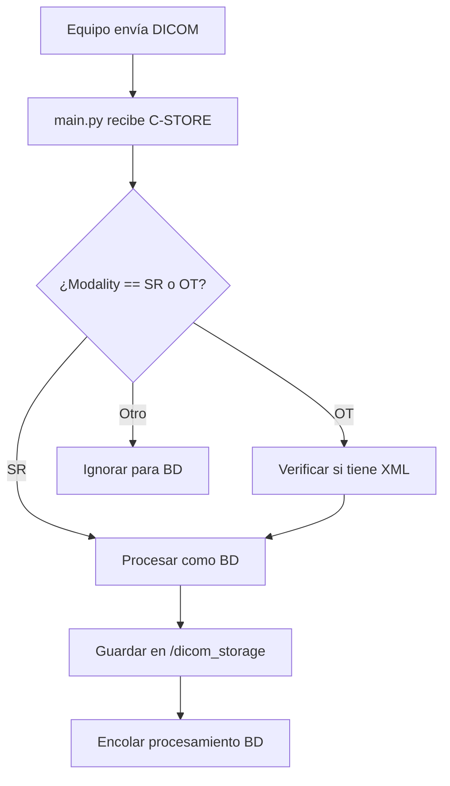

# Lógica de Construcción de Reportes de Densitometría Ósea (BD)
## Sistema de Procesamiento Automatizado

**Fecha de Documentación:** Abril 7, 2026  
**Sistema:** DICOM Receiver - Bone Densitometry Automated Reporting  
**Base de Datos:** PostgreSQL - Schema `reports.bd`

---

## TABLA DE CONTENIDOS

1. [Arquitectura General](#1-arquitectura-general)
2. [Flujo de Procesamiento](#2-flujo-de-procesamiento)
3. [Extracción de Datos por Fabricante](#3-extracción-de-datos-por-fabricante)
4. [Construcción del Reporte](#4-construcción-del-reporte)
5. [Persistencia en Base de Datos](#5-persistencia-en-base-de-datos)
6. [Consideraciones Especiales](#6-consideraciones-especiales)
7. [Algoritmos de Clasificación](#7-algoritmos-de-clasificación)
8. [Manejo de Errores y Validaciones](#8-manejo-de-errores-y-validaciones)

---

## 1. ARQUITECTURA GENERAL

### 1.1 Componentes del Sistema

El sistema sigue una arquitectura modular:

```
DICOM Equipment → DICOM Receiver (main.py) → bd_worker.py → Algorithm Scripts → PostgreSQL
                                                    ↓
                                        Queue Manager (async)
                                                    ↓
                                          Report Generation
```

**Componentes Principales:**

1. **main.py**: Servidor DICOM que recibe estudios (puerto 5665, AE Title: "DICOM_RECEIVER")
2. **bd_worker.py**: Coordinador que detecta fabricante y enruta procesamiento
3. **bd_extract_*.py**: Algoritmos específicos por fabricante
4. **queue_manager.py**: Maneja procesamiento asíncrono en cola
5. **PostgreSQL**: Base de datos `reports.bd` para persistencia

### 1.2 Identificadores Únicos

Cada estudio se identifica por:

- **MRN (Medical Record Number)**: Identificador del paciente
- **Accession Number (ACC)**: Identificador único del estudio
- **GUID**: Generado automáticamente por el sistema (UUID v4)

**Clave de duplicados:** `(MRN, ACC)` - Si existe un registro con estos valores, se actualiza en lugar de insertar.

### 1.3 Almacenamiento de Archivos

```
/dicom_storage/{MRN}/{StudyInstanceUID}/*.dcm
/home/ubuntu/DICOMReceiver/reports/bd_report_{MRN}_{ACC}.txt
```

---

## 2. FLUJO DE PROCESAMIENTO

### 2.1 Recepción de Estudio DICOM



### 2.2 Detección del Fabricante

**Función:** `detect_bd_manufacturer()` en `bd_worker.py`

```python
def detect_bd_manufacturer(ds: pydicom.Dataset) -> Tuple[Optional[str], str, str]:
    """
    Retorna: (manufacturer, institution, algorithm_path)
    """
```

**Lógica de Detección:**

1. **Leer campo Manufacturer del header DICOM**
   - Si contiene "HOLOGIC" → Hologic
   - Si contiene "GE" → GE Lunar

2. **Identificar institución** (Station Name o Institution Name)
   - "DESERT" → Desert Radiology
   - "MEMORIAL" → Memorial Hermann
   - Otro → General

3. **Seleccionar algoritmo específico:**
   ```
   GE Lunar                    → bd_extract_ge.py
   Hologic + Desert            → bd_extract_hologic_desert.py
   Hologic + Memorial          → bd_extract_hologic_memorial.py
   Hologic + Otro              → bd_extract_hologic.py
   ```

### 2.3 Enrutamiento a Algoritmo

El worker llama al script correspondiente que:

1. **Extrae datos estructurados** del DICOM
2. **Calcula métricas derivadas** (cambios porcentuales, clasificación WHO)
3. **Genera reporte en texto** usando template médico
4. **Persiste en PostgreSQL** (INSERT o UPDATE)

---

## 3. EXTRACCIÓN DE DATOS POR FABRICANTE

### 3.1 GE Healthcare Lunar (Enhanced SR)

**Características:**
- Formato: Enhanced Structured Report (DICOM SR)
- Múltiples archivos SR por estudio (15-25 archivos típicamente)
- Estructura jerárquica con `ContentSequence`

**Lógica de Extracción:**

```python
# 1. Buscar TODOS los archivos SR del paciente
sr_files = [f for f in os.listdir(sr_dir) if f.startswith('SR_')]

# 2. Leer cada archivo SR
for sr_file in sr_files:
    ds = pydicom.dcmread(sr_file, force=True)
    
    # 3. Navegar estructura jerárquica
    if hasattr(ds, 'ContentSequence'):
        process_content_sequence(ds.ContentSequence)
```

**Estructura del ContentSequence:**
```
ContentSequence [nivel 0]
├── [4] CONTAINER: "AP Spine"
│   └── [0] CONTAINER: "L1-L4"
│       ├── [0] NUM: BMD = 0.957
│       ├── [3] NUM: T-score = -1.2
│       └── [4] NUM: Z-score = 0.3
└── [5] CONTAINER: "DualFemur"
    ├── [0] CONTAINER: "Neck Left"
    │   ├── [0] NUM: BMD = 0.843
    │   ├── [3] NUM: T-score = -1.8
    │   └── [4] NUM: Z-score = -0.5
    └── [1] CONTAINER: "Neck Right"
```

**Regiones Extraídas:**
- Lumbar Spine (L1-L4, L2-L4, etc.)
- Left Hip (Neck, Total)
- Right Hip (Neck, Total)
- Left Forearm (33% Radius, Total)
- Right Forearm (33% Radius, Total)

**Datos por Región:**
- `BMD (g/cm²)`: Bone Mineral Density
- `T-score`: Comparación con adultos jóvenes sanos
- `Z-score`: Comparación con grupo de edad equivalente
- `BMC (g)`: Bone Mineral Content
- `Area (cm²)`: Área de medición

### 3.2 Hologic (XML embebido)

**Características:**
- Formato: Secondary Capture (OT) + XML embebido
- XML extraído del campo `TextValue` o `ContentSequence`
- Tabla de resultados en XML: `ResultsTable1`, `ResultsTable2`, `ResultsTable3`

**Variantes por Institución:**

#### 3.2.1 Desert Radiology (Single-Hip Format)
- **Cada archivo contiene UNA sola cadera** (left o right)
- **Lateralidad detectada por:** Campo `ScanMode` ("Right Hip" o "Left Hip")
- **Requiere combinación** de múltiples archivos para estudio completo

**Lógica de Detección del Formato:**
```python
# Verificar si es dual-hip (ambas caderas en un archivo)
left_hip_pattern = r'ResultsTable1\[\s*\d+\]\[\s*0\]\s*=\s*"[^"]*LEFT[^"]*"'
right_hip_pattern = r'ResultsTable1\[\s*\d+\]\[\s*0\]\s*=\s*"[^"]*RIGHT[^"]*"'

has_left = re.search(left_hip_pattern, xml_text)
has_right = re.search(right_hip_pattern, xml_text)

if has_left and has_right:
    format_type = 'DUAL_HIP'  # Memorial o otro
else:
    format_type = 'SINGLE_HIP'  # Desert Radiology
```

**Ejemplo de Extracción (Desert):**
```python
# Buscar fila con "Neck" (no "Femoral Neck" completo)
for row in range(10):
    region_match = re.search(rf'ResultsTable1\[\s*{row}\]\[\s*0\]\s*=\s*"([^"]+)"', xml_text)
    if region_match and 'NECK' in region_match.group(1).upper():
        # Extraer BMD, T-score, Z-score
        bmd_match = re.search(rf'ResultsTable1\[\s*{row}\]\[\s*3\]\s*=\s*"([^"]+)"', xml_text)
        tscore_match = re.search(rf'ResultsTable1\[\s*{row}\]\[\s*4\]\s*=\s*"([^"]+)"', xml_text)
        
        # Determinar lateralidad
        if 'RIGHT' in scan_mode.upper():
            data['right_hip_bmd'] = bmd_match.group(1)
            data['right_hip_tscore'] = tscore_match.group(1)
        else:
            data['left_hip_bmd'] = bmd_match.group(1)
            data['left_hip_tscore'] = tscore_match.group(1)
```

#### 3.2.2 Memorial Hermann (Dual-Hip Format)
- **Ambas caderas en UN SOLO archivo**
- **Regiones claramente etiquetadas:** "Left Femoral Neck", "Right Femoral Neck"
- **FRAX en tabla separada:** `ResultsTable3` contiene valores "with prior fracture"

**Diferencia Clave con Desert:**
```python
# Memorial: Buscar "Femoral Neck Left" y "Femoral Neck Right" explícitamente
for row in range(10):
    region_match = re.search(rf'ResultsTable1\[\s*{row}\]\[\s*0\]\s*=\s*"([^"]+)"', xml_text)
    if region_match:
        region_name = region_match.group(1).strip().upper()
        
        if 'LEFT' in region_name and 'FEMORAL NECK' in region_name:
            # Extraer left hip
            data['left_hip_bmd'] = ...
        elif 'RIGHT' in region_name and 'FEMORAL NECK' in region_name:
            # Extraer right hip
            data['right_hip_bmd'] = ...
```

### 3.3 Tablas de Resultados XML (Hologic)

**ResultsTable1: Datos del Estudio Actual**
```
[Row][Col] = Value
[0][0] = "Neck"              # Región anatómica
[0][3] = "0.843"             # BMD (g/cm²)
[0][4] = "-1.8"              # T-score
[0][6] = "-0.5"              # Z-score
```

**ResultsTable2: Comparación Histórica**
```
[1][5] = "2.3%"              # Cambio porcentual vs estudio previo
[2][0] = "12/15/2023"        # Fecha del estudio previo
[2][2] = "0.824"             # BMD previo
```

**ResultsTable3: FRAX (solo en estudios de cadera)**
```
[1][0] = "10-yr probability major osteoporotic fracture"
[1][1] = "8.5%"              # FRAX mayor sin fractura previa
[2][0] = "10-yr probability hip fracture"
[2][1] = "2.1%"              # FRAX cadera sin fractura previa
```

---

## 4. CONSTRUCCIÓN DEL REPORTE

### 4.1 Datos Extraídos

Cada algoritmo retorna un diccionario con:

```python
data = {
    # Identificación
    'patient_id': 'MRN12345',
    'accession_number': 'ACC67890',
    'pat_name': 'DOE, JOHN',
    
    # Lumbar Spine
    'lumbar_bmd': 0.957,
    'lumbar_tscore': -1.2,
    'lumbar_zscore': 0.3,
    'lumbar_vertebrae_range': 'L1-L4',
    
    # Left Hip
    'left_hip_bmd': 0.843,
    'left_hip_tscore': -1.8,
    'left_hip_zscore': -0.5,
    
    # Right Hip
    'right_hip_bmd': 0.851,
    'right_hip_tscore': -1.7,
    'right_hip_zscore': -0.4,
    
    # Forearm (si aplica)
    'left_forearm_bmd': 0.712,
    'left_forearm_tscore': -2.1,
    'left_forearm_zscore': -1.2,
    
    # FRAX (solo en estudios de cadera)
    'major_fracture_risk': 8.5,           # % riesgo fractura mayor (sin fractura previa)
    'hip_fracture_risk': 2.1,             # % riesgo fractura cadera (sin fractura previa)
    'major_fracture_risk_prior': 12.3,    # % con fractura previa (Memorial)
    'hip_fracture_risk_prior': 4.7,       # % con fractura previa (Memorial)
    
    # Comparación Histórica
    'lumbar_prev_date': '12/15/2023',
    'lumbar_prev_bmd': 0.945,
    'lumbar_change_percent': '+1.3%',
    'left_hip_prev_date': '12/15/2023',
    'left_hip_prev_bmd': 0.835,
    'left_hip_change_percent': '+1.0%',
    
    # Clasificación WHO (calculada)
    'who_classification': 'Osteopenia'
}
```

### 4.2 Cálculo de Comparación Histórica

**Lógica de Cálculo de Cambio Porcentual:**

```python
def calculate_change_percent(current_bmd: float, previous_bmd: float) -> str:
    """
    Calcula el cambio porcentual entre dos mediciones de BMD.
    
    Si |cambio| ≤ 3%: "estable" (variación dentro del margen de error del equipo)
    Si cambio > 3%: "aumentó"
    Si cambio < -3%: "disminuyó"
    """
    if current_bmd and previous_bmd:
        change = ((current_bmd - previous_bmd) / previous_bmd) * 100
        return f"{change:+.1f}%"  # Formato: +2.3% o -1.5%
    return None
```

**Reglas de Interpretación:**

1. **Cambio ≤ 3% (en valor absoluto):** "Remained stable"
   - Razón: Precisión del equipo es ±1-3%, cambios menores no son significativos

2. **Cambio > 3%:** "Increased by X%"
   - Indica mejora significativa en densidad ósea

3. **Cambio < -3%:** "Decreased by X%"
   - Indica pérdida significativa de densidad ósea

### 4.3 Clasificación WHO

**Función:** `classify_who_by_tscore(tscore: float) -> str`

**Criterios (basados en T-score):**

```python
def classify_who_by_tscore(tscore_str):
    """
    Clasificación WHO de Osteoporosis
    Basada en T-score (comparación con adultos jóvenes sanos)
    """
    try:
        tscore = float(tscore_str)
        
        if tscore >= -1.0:
            return "Normal"
        elif -2.5 < tscore < -1.0:
            return "Osteopenia"
        elif tscore <= -2.5:
            return "Osteoporosis"
        else:
            return "Unknown"
    except:
        return "Unknown"
```

**Tabla de Clasificación:**

| T-score        | Clasificación  | Significado Clínico                          |
|----------------|----------------|----------------------------------------------|
| ≥ -1.0         | Normal         | Densidad ósea dentro del rango normal        |
| -1.0 a -2.5    | Osteopenia     | Densidad ósea baja, riesgo intermedio        |
| ≤ -2.5         | Osteoporosis   | Densidad ósea muy baja, alto riesgo fractura |

**Clasificación Detallada por Región:**

El reporte incluye clasificación independiente para cada región:

```python
def generate_who_classification_detailed(data, hip_side):
    """Clasifica cada región anatómica individualmente"""
    
    classifications = []
    
    # Lumbar
    if data.get('lumbar_tscore'):
        lumbar_class = classify_who_by_tscore(data['lumbar_tscore'])
        classifications.append(f"  Lumbar spine: {lumbar_class}")
    
    # Left Hip
    if data.get('left_hip_tscore'):
        left_class = classify_who_by_tscore(data['left_hip_tscore'])
        classifications.append(f"  Left hip: {left_class}")
    
    # Right Hip
    if data.get('right_hip_tscore'):
        right_class = classify_who_by_tscore(data['right_hip_tscore'])
        classifications.append(f"  Right hip: {right_class}")
    
    # Forearm
    if data.get('left_forearm_tscore'):
        forearm_class = classify_who_by_tscore(data['left_forearm_tscore'])
        classifications.append(f"  Left forearm: {forearm_class}")
    
    return "\n".join(classifications)
```

### 4.4 Generación del Reporte en Texto

**Función:** `generate_report(data: dict) -> str`

**Estructura del Reporte:**

```
BONE DENSITOMETRY REPORT

TECHNIQUE:
  Dual-energy x-ray absorptiometry of {regions}.

FINDINGS:
  Lumbar spine (L1-L4):
    BMD: 0.957 g/cm²
    T-score: -1.2
    Z-score: 0.3
  
  Left hip (femoral neck):
    BMD: 0.843 g/cm²
    T-score: -1.8
    Z-score: -0.5
  
  Right hip (femoral neck):
    BMD: 0.851 g/cm²
    T-score: -1.7
    Z-score: -0.4

COMPARISON:
  Lumbar spine: The bone mineral density increased by 1.3% since [2023].
  Left hip: The bone mineral density remained stable since [2023].
  Right hip: The bone mineral density remained stable since [2023].

10-YEAR FRACTURE PROBABILITY (FRAX):
  Major osteoporotic fracture: 8.5%
  Hip fracture: 2.1%

WHO CLASSIFICATION:
  Lumbar spine: Osteopenia
  Left hip: Osteopenia
  Right hip: Osteopenia

IMPRESSION:
  Osteopenia of the lumbar spine and both hips.
```

**Reglas de Formateo:**

1. **Regions List:** Formato gramaticalmente correcto
   - 1 región: "the lumbar spine"
   - 2 regiones: "the lumbar spine and the left hip"
   - 3+ regiones: "the lumbar spine, both forearms, and both hips"

2. **Comparación Histórica:** Solo incluir si hay datos previos válidos
   - Debe tener: fecha previa AND cambio porcentual
   - Si |cambio| ≤ 3%: "remained stable"
   - Si cambio > 3%: "increased by X%"
   - Si cambio < -3%: "decreased by X%"

3. **FRAX:** Solo incluir en estudios de cadera
   - No mostrar si estudio es solo lumbar spine
   - Validar que valores sean < 50% (valores ≥50 son probablemente edad, no FRAX)

4. **Impression:** Agrupar regiones por clasificación
   ```
   Ejemplo 1: "Osteopenia of the lumbar spine and both hips."
   Ejemplo 2: "Osteoporosis of the left hip. Osteopenia of the lumbar spine."
   Ejemplo 3: "Normal bone mineralization of the lumbar spine."
   ```

---

## 5. PERSISTENCIA EN BASE DE DATOS

### 5.1 Schema de la Tabla `reports.bd`

```sql
CREATE TABLE reports.bd (
    guid VARCHAR(36) PRIMARY KEY,                    -- UUID único
    mrn VARCHAR(50) NOT NULL,                        -- Medical Record Number
    acc VARCHAR(50) NOT NULL,                        -- Accession Number
    pat_name VARCHAR(255),                           -- Nombre del paciente
    report TEXT,                                     -- Reporte completo en texto
    
    -- Lumbar Spine
    lumbar_bmd NUMERIC(6,3),                         -- g/cm²
    lumbar_tscore NUMERIC(4,1),
    lumbar_zscore NUMERIC(4,1),
    
    -- Left Hip
    left_hip_bmd NUMERIC(6,3),
    left_hip_tscore NUMERIC(4,1),
    left_hip_zscore NUMERIC(4,1),
    
    -- Right Hip
    right_hip_bmd NUMERIC(6,3),
    right_hip_tscore NUMERIC(4,1),
    right_hip_zscore NUMERIC(4,1),
    
    -- Left Forearm
    left_forearm_bmd NUMERIC(6,3),
    left_forearm_tscore NUMERIC(4,1),
    left_forearm_zscore NUMERIC(4,1),
    
    -- Right Forearm
    right_forearm_bmd NUMERIC(6,3),
    right_forearm_tscore NUMERIC(4,1),
    right_forearm_zscore NUMERIC(4,1),
    
    -- FRAX (solo en estudios de cadera)
    major_fracture_risk NUMERIC(4,1),                -- % riesgo sin fractura previa
    "hip_fracture_risk│" NUMERIC(4,1),               -- Nombre especial por legado
    major_fracture_risk_prior NUMERIC(4,1),          -- % con fractura previa (Memorial)
    hip_fracture_risk_prior NUMERIC(4,1),
    
    -- Comparación Histórica
    lumbar_prev_date VARCHAR(20),                    -- Fecha estudio previo
    lumbar_prev_bmd NUMERIC(6,3),                    -- BMD previo
    lumbar_change_percent VARCHAR(20),               -- "+2.3%" o "-1.5%"
    left_hip_prev_date VARCHAR(20),
    left_hip_prev_bmd NUMERIC(6,3),
    left_hip_change_percent VARCHAR(20),
    right_hip_prev_date VARCHAR(20),
    right_hip_prev_bmd NUMERIC(6,3),
    right_hip_change_percent VARCHAR(20),
    left_forearm_prev_date VARCHAR(20),
    left_forearm_prev_bmd NUMERIC(6,3),
    left_forearm_change_percent VARCHAR(20),
    right_forearm_prev_date VARCHAR(20),
    right_forearm_prev_bmd NUMERIC(6,3),
    right_forearm_change_percent VARCHAR(20),
    
    -- Clasificación WHO
    "WHO_Classification" VARCHAR(50),                -- "Normal" | "Osteopenia" | "Osteoporosis"
    
    -- Timestamps
    receivedon TIMESTAMP DEFAULT CURRENT_TIMESTAMP,
    studydate TIMESTAMP,
    
    -- Constraint: MRN + ACC deben ser únicos
    CONSTRAINT uk_mrn_acc UNIQUE (mrn, acc)
);
```

**Notas sobre el Schema:**

1. **Nombres con caracteres especiales:**
   - `"hip_fracture_risk│"` - Contiene carácter especial por razones de legado
   - `"WHO_Classification"` - Mayúsculas por convención médica

2. **Tipos de datos:**
   - `NUMERIC(6,3)`: Para BMD (ej: 0.957 → 3 decimales)
   - `NUMERIC(4,1)`: Para T-score/Z-score (ej: -1.8 → 1 decimal)
   - `VARCHAR(20)`: Para cambios porcentuales (almacenados como texto: "+2.3%")

3. **Constraint de unicidad:** `(mrn, acc)` - Previene duplicados por combinación MRN + Accession

### 5.2 Lógica INSERT vs UPDATE

**Flujo de Decisión:**

```python
# 1. Verificar si ya existe un registro con ese MRN + ACC
cursor.execute("""
    SELECT guid 
    FROM reports.bd 
    WHERE mrn = %s AND acc = %s
""", (mrn, acc))

existing = cursor.fetchone()

if existing:
    # ACTUALIZAR registro existente
    update_existing_record(existing['guid'], data, report)
else:
    # INSERTAR nuevo registro
    insert_new_record(data, report)
```

### 5.3 Lógica de UPDATE (Combinación de Datos)

**Problema:** En Hologic Desert, cada archivo XML contiene solo UNA región (un hip o lumbar spine). Para un estudio completo, pueden llegar múltiples archivos en momentos diferentes.

**Solución:** Combinar datos de múltiples archivos en un solo registro.

```python
def update_existing_record(existing_guid, new_data, new_report):
    """
    Combina datos nuevos con existentes, preservando valores válidos.
    
    Reglas:
    1. Si campo nuevo tiene valor Y campo existente está vacío → Usar nuevo
    2. Si campo nuevo está vacío Y campo existente tiene valor → Preservar existente
    3. Si AMBOS tienen valor → Usar nuevo (actualización)
    4. FRAX: Usar el MAYOR valor válido (< 50%)
    5. Preservar lumbar_vertebrae_range si nuevo es None
    """
    
    # Leer registro existente
    existing_data = fetch_existing_data(existing_guid)
    
    # Combinar datos
    combined_data = existing_data.copy()
    
    for key, new_value in new_data.items():
        existing_value = existing_data.get(key)
        
        # Caso 1: Nuevo valor existe, existente vacío
        if new_value and not existing_value:
            combined_data[key] = new_value
        
        # Caso 2: Nuevo vacío, existente tiene valor
        elif not new_value and existing_value:
            combined_data[key] = existing_value
        
        # Caso 3: Ambos tienen valor
        elif new_value and existing_value:
            # FRAX: Mantener el MAYOR valor válido
            if key in ['major_fracture_risk', 'hip_fracture_risk']:
                new_frax = validate_frax(new_value)
                existing_frax = validate_frax(existing_value)
                if new_frax and existing_frax:
                    combined_data[key] = max(new_frax, existing_frax)
                elif new_frax:
                    combined_data[key] = new_frax
                else:
                    combined_data[key] = existing_frax
            else:
                # Para otros campos: usar nuevo (actualización)
                combined_data[key] = new_value
    
    # Regenerar reporte con datos combinados
    combined_report = generate_report(combined_data)
    
    # UPDATE en base de datos
    cursor.execute("""
        UPDATE reports.bd SET
            report = %s,
            left_hip_bmd = %s,
            left_hip_tscore = %s,
            left_hip_zscore = %s,
            right_hip_bmd = %s,
            right_hip_tscore = %s,
            right_hip_zscore = %s,
            lumbar_bmd = %s,
            lumbar_tscore = %s,
            lumbar_zscore = %s,
            -- ... todos los campos ...
            receivedon = %s
        WHERE guid = %s
    """, (combined_report, ..., existing_guid))
```

**Regla Especial para FRAX (Memorial vs Desert):**

```python
# Memorial dual-hip tiene prioridad ABSOLUTA sobre single-hip anterior
if new_data.get('_is_memorial_frax'):
    # Sobreescribir todos los valores FRAX con los del archivo Memorial
    for frax_key in ['major_fracture_risk', 'hip_fracture_risk', 
                     'major_fracture_risk_prior', 'hip_fracture_risk_prior']:
        if new_data.get(frax_key):
            combined_data[frax_key] = new_data[frax_key]
```

### 5.4 Lógica de INSERT

```python
def insert_new_record(data, report):
    """Inserta nuevo registro en base de datos."""
    
    # Generar GUID único
    guid = str(uuid.uuid4())
    
    # Convertir valores numéricos con 3 decimales de precisión
    def to_float(val):
        if not val:
            return None
        val_str = str(val).replace('%', '').strip()
        try:
            return round(float(val_str), 3)
        except:
            return None
    
    # INSERT
    cursor.execute("""
        INSERT INTO reports.bd (
            guid, mrn, acc, pat_name, report,
            lumbar_bmd, lumbar_tscore, lumbar_zscore,
            left_hip_bmd, left_hip_tscore, left_hip_zscore,
            right_hip_bmd, right_hip_tscore, right_hip_zscore,
            left_forearm_bmd, left_forearm_tscore, left_forearm_zscore,
            right_forearm_bmd, right_forearm_tscore, right_forearm_zscore,
            major_fracture_risk, "hip_fracture_risk│", "WHO_Classification",
            major_fracture_risk_prior, hip_fracture_risk_prior,
            lumbar_prev_date, lumbar_prev_bmd, lumbar_change_percent,
            left_hip_prev_date, left_hip_prev_bmd, left_hip_change_percent,
            right_hip_prev_date, right_hip_prev_bmd, right_hip_change_percent,
            receivedon, studydate
        ) VALUES (
            %s, %s, %s, %s, %s,
            %s, %s, %s,
            %s, %s, %s,
            %s, %s, %s,
            %s, %s, %s,
            %s, %s, %s,
            %s, %s, %s,
            %s, %s,
            %s, %s, %s,
            %s, %s, %s,
            %s, %s, %s,
            CURRENT_TIMESTAMP, CURRENT_TIMESTAMP
        )
    """, (
        guid, 
        data.get('patient_id'), 
        data.get('accession_number'),
        data.get('pat_name'),
        report,
        to_float(data.get('lumbar_bmd')),
        to_float(data.get('lumbar_tscore')),
        to_float(data.get('lumbar_zscore')),
        # ... todos los valores ...
    ))
    
    conn.commit()
```

### 5.5 Validación de Datos

**Función:** `to_float(val) -> Optional[float]`

```python
def to_float(val):
    """
    Convierte valor a float con 3 decimales de precisión.
    
    Maneja:
    - None → None
    - "" → None
    - "0.957" → 0.957
    - "-1.8" → -1.8
    - "2.3%" → 2.3 (elimina %)
    - "<0.1" → 0.1 (elimina <)
    """
    if not val:
        return None
    
    val_str = str(val).replace('%', '').replace('<', '').strip()
    
    try:
        return round(float(val_str), 3)
    except:
        return None
```

**Validación de FRAX:**

```python
def validate_frax(value):
    """
    Valida que un valor sea FRAX válido (no BMD ni edad).
    
    FRAX típicamente es < 50% (rara vez > 40%)
    Valores >= 50 probablemente son edad (50-100 años) o BMD
    """
    try:
        val_str = str(value).replace('%', '').replace('<', '').strip()
        num_val = float(val_str)
        
        if 0 <= num_val < 50:
            return num_val
        else:
            return None  # No es FRAX válido
    except:
        return None
```

---

## 6. CONSIDERACIONES ESPECIALES

### 6.1 Manejo de Múltiples Archivos (Hologic Desert)

**Problema:**
- Desert Radiology envía estudios en MÚLTIPLES archivos XML separados
- Cada archivo contiene solo UNA región (left hip OR right hip OR lumbar spine)
- Los archivos pueden llegar con minutos/horas de diferencia

**Solución:**
1. **Primera llegada:** INSERT nuevo registro con datos parciales
2. **Llegadas subsecuentes:** UPDATE combinando datos
3. **Preservar datos existentes:** No sobrescribir valores válidos con NULL

**Ejemplo de Flujo:**

```
t=0:  Llega "Left Hip" → INSERT (left_hip_bmd=0.843, right_hip_bmd=NULL, lumbar_bmd=NULL)
t=5:  Llega "Right Hip" → UPDATE (left_hip_bmd=0.843, right_hip_bmd=0.851, lumbar_bmd=NULL)
t=10: Llega "Lumbar Spine" → UPDATE (left_hip_bmd=0.843, right_hip_bmd=0.851, lumbar_bmd=0.957)
```

**Cache Global para Preservar Datos:**

```python
# Cache para preservar lumbar_vertebrae_range entre archivos
_lumbar_vertebrae_cache = {}

# Guardar en caché
_lumbar_vertebrae_cache[patient_id] = 'L1-L4'

# Recuperar en archivo subsecuente
if patient_id in _lumbar_vertebrae_cache:
    data['lumbar_vertebrae_range'] = _lumbar_vertebrae_cache[patient_id]
```

### 6.2 FRAX: Memorial vs Desert

**Diferencia Fundamental:**

| Aspecto              | Memorial Hermann                | Desert Radiology              |
|----------------------|---------------------------------|-------------------------------|
| Formato              | Dual-hip (ambas caderas)        | Single-hip (una cadera)       |
| FRAX "without prior" | Sí, valor específico del paciente | Sí, valor específico          |
| FRAX "with prior"    | **Sí, columna separada**        | **No disponible**             |
| Ubicación en XML     | ResultsTable3                   | ResultsTable2                 |

**Regla de Limpieza:**

```python
# Script: clean_desert_frax_prior.py
# Limpia valores "prior" incorrectos de estudios Desert

for mrn, acc in desert_studies:
    cursor.execute("""
        UPDATE reports.bd 
        SET major_fracture_risk_prior = NULL,
            hip_fracture_risk_prior = NULL
        WHERE mrn = %s AND acc = %s
    """, (mrn, acc))
```

**Regla de Priorización:**

Si un paciente tiene AMBOS formatos (ej: estudios antiguos de Desert + nuevos de Memorial):
- **Preservar valores "prior" solo de Memorial**
- **Eliminar valores "prior" de Desert** (son cálculos genéricos, no específicos del paciente)

### 6.3 Detectar Región de Forearm Óptima

**Problema:** Equipos Hologic miden múltiples regiones del antebrazo:
- **UD** (Ultra Distal): Punta del radio
- **MID** (Mid): Región media
- **1/3** (33% Radius): Un tercio del largo
- **TOTAL**: Promedio de todas

**Criterio de Selección:** Usar la región con el **T-score MÁS BAJO** (más negativo) porque:
- Es la región más afectada por osteoporosis
- Es clínicamente más relevante para diagnóstico
- Sigue las recomendaciones de ISCD (International Society for Clinical Densitometry)

```python
# Buscar TODAS las regiones de forearm
forearm_regions = []
for row in range(10):
    region_match = re.search(rf'ResultsTable1\[\s*{row}\]\[\s*0\]\s*=\s*"([^"]+)"', xml_text)
    if region_match:
        region_name = region_match.group(1).strip().upper()
        if region_name in ['1/3', 'MID', 'UD', 'TOTAL']:
            tscore_match = re.search(rf'ResultsTable1\[\s*{row}\]\[\s*4\]\s*=\s*"([^"]+)"', xml_text)
            if tscore_match:
                forearm_regions.append({
                    'region': region_name,
                    'tscore': float(tscore_match.group(1)),
                    'bmd': bmd_val,
                    'zscore': zscore_val
                })

# Seleccionar región con T-score más bajo (más negativo)
best_region = min(forearm_regions, key=lambda x: x['tscore'])
data['left_forearm_bmd'] = best_region['bmd']
data['left_forearm_tscore'] = str(best_region['tscore'])
```

### 6.4 Detección de Vértebras Lumbares

**Problema:** No todas las mediciones incluyen las mismas vértebras:
- Algunas: L1-L4 (más común)
- Otras: L2-L4 (excluyen L1 por artefactos)
- Otras: L1-L3 (excluyen L4 por artritis)

**Lógica de Detección:**

```python
# Buscar qué vértebras individuales están presentes ANTES de la fila "Total"
vertebrae = []
for row in range(1, total_row):
    vert_match = re.search(rf'ResultsTable1\[\s*{row}\]\[\s*0\]\s*=\s*"([^"]+)"', xml_text)
    if vert_match:
        vert_name = vert_match.group(1).strip().upper()
        if vert_name in ['L1', 'L2', 'L3', 'L4']:
            vertebrae.append(vert_name)

# Generar rango
if len(vertebrae) >= 2:
    data['lumbar_vertebrae_range'] = f"{vertebrae[0]}-{vertebrae[-1]}"  # "L1-L4"
elif len(vertebrae) == 1:
    data['lumbar_vertebrae_range'] = vertebrae[0]  # "L3"
else:
    data['lumbar_vertebrae_range'] = "L1-L4"  # Default
```

**Uso en Reporte:**

```
FINDINGS:
  Lumbar spine (L2-L4):      ← Rango detectado
    BMD: 0.957 g/cm²
    ...
```

### 6.5 Tolerancia para "Cambio Estable"

**Regla de los 3%:**

```python
# Margen de error típico de equipos DEXA: ±1-3%
STABLE_THRESHOLD = 3.0

if abs(change_percent) <= STABLE_THRESHOLD:
    text = "remained stable"
elif change_percent > STABLE_THRESHOLD:
    text = f"increased by {change_percent:.1f}%"
else:  # change_percent < -STABLE_THRESHOLD
    text = f"decreased by {abs(change_percent):.1f}%"
```

**Rationale:**
- **Precisión del equipo:** Los equipos DEXA tienen precisión de ±1-3%
- **Variabilidad biológica:** Posicionamiento, hidratación del paciente
- **Significancia clínica:** Cambios < 3% no son clínicamente significativos

### 6.6 Manejo de Datos Faltantes

**Estrategia:** "Fail Gracefully" - No interrumpir procesamiento si faltan datos

```python
# Verificar existencia antes de usar
if data.get('lumbar_bmd'):
    # Procesar lumbar
    pass

if data.get('left_hip_bmd') or data.get('right_hip_bmd'):
    # Procesar caderas
    pass

# En el reporte, omitir secciones sin datos
if not lumbar_bmd and not lumbar_tscore:
    # No incluir sección "Lumbar spine" en reporte
    pass
```

---

## 7. ALGORITMOS DE CLASIFICACIÓN

### 7.1 Clasificación WHO Individual

```python
def classify_who_by_tscore(tscore_str):
    """
    Clasifica una región anatómica según criterios WHO.
    
    Entrada: T-score como string ("-1.8") o float (-1.8)
    Salida: "Normal" | "Osteopenia" | "Osteoporosis" | "Unknown"
    """
    try:
        tscore = float(tscore_str)
        
        if tscore >= -1.0:
            return "Normal"
        elif -2.5 < tscore < -1.0:
            return "Osteopenia"
        elif tscore <= -2.5:
            return "Osteoporosis"
        else:
            return "Unknown"
    except:
        return "Unknown"
```

### 7.2 Generación de IMPRESSION Agrupada

**Objetivo:** Agrupar regiones con la misma clasificación en una oración cohesiva.

```python
def generate_impression(data, hip_side):
    """
    Genera IMPRESSION agrupando regiones por clasificación.
    
    Ejemplo:
    - Si Lumbar + Left Hip = Osteopenia → "Osteopenia of the lumbar spine and left hip."
    - Si Left Hip = Osteoporosis, Lumbar = Osteopenia → "Osteoporosis of the left hip. Osteopenia of the lumbar spine."
    """
    
    # Clasificar cada región
    regions_by_classification = {
        'Osteoporosis': [],
        'Osteopenia': [],
        'Normal': []
    }
    
    # Evaluar lumbar
    if data.get('lumbar_tscore'):
        lumbar_class = classify_who_by_tscore(data['lumbar_tscore'])
        if lumbar_class in regions_by_classification:
            regions_by_classification[lumbar_class].append('the lumbar spine')
    
    # Evaluar left hip
    if data.get('left_hip_tscore'):
        left_hip_class = classify_who_by_tscore(data['left_hip_tscore'])
        if left_hip_class in regions_by_classification:
            regions_by_classification[left_hip_class].append('the left hip')
    
    # Evaluar right hip
    if data.get('right_hip_tscore'):
        right_hip_class = classify_who_by_tscore(data['right_hip_tscore'])
        if right_hip_class in regions_by_classification:
            regions_by_classification[right_hip_class].append('the right hip')
    
    # Evaluar forearm
    if data.get('left_forearm_tscore'):
        forearm_class = classify_who_by_tscore(data['left_forearm_tscore'])
        if forearm_class in regions_by_classification:
            regions_by_classification[forearm_class].append('the left forearm')
    
    # Construir impresiones
    impressions = []
    
    # Prioridad: Osteoporosis > Osteopenia > Normal
    if regions_by_classification['Osteoporosis']:
        regions = format_regions_list(regions_by_classification['Osteoporosis'])
        impressions.append(f"Osteoporosis of {regions}.")
    
    if regions_by_classification['Osteopenia']:
        regions = format_regions_list(regions_by_classification['Osteopenia'])
        impressions.append(f"Osteopenia of {regions}.")
    
    if regions_by_classification['Normal']:
        regions = format_regions_list(regions_by_classification['Normal'])
        impressions.append(f"Normal bone mineralization of {regions}.")
    
    # Si no hay clasificaciones, mensaje genérico
    if not impressions:
        impressions.append("Bone density measurements as detailed above.")
    
    return '\n  '.join(impressions)
```

**Helper: Formatear Lista de Regiones**

```python
def format_regions_list(regions):
    """
    Formatea lista con gramática correcta.
    
    Ejemplos:
    - ['the lumbar spine'] → "the lumbar spine"
    - ['the lumbar spine', 'the left hip'] → "the lumbar spine and the left hip"
    - ['the lumbar spine', 'the left hip', 'the right hip'] 
      → "the lumbar spine, the left hip, and the right hip"
    """
    if not regions:
        return ""
    elif len(regions) == 1:
        return regions[0]
    elif len(regions) == 2:
        return f"{regions[0]} and {regions[1]}"
    else:
        # Oxford comma
        return ", ".join(regions[:-1]) + f", and {regions[-1]}"
```

### 7.3 Optimización: "Both Hips" vs "Left Hip and Right Hip"

```python
# Si ambas caderas tienen datos, consolidar en "both hips"
if has_left_hip and has_right_hip:
    regions.append('both hips')
elif has_left_hip:
    regions.append('the left hip')
elif has_right_hip:
    regions.append('the right hip')
```

---

## 8. MANEJO DE ERRORES Y VALIDACIONES

### 8.1 Validación de Datos de Entrada

```python
def validate_dicom_data(ds):
    """Valida que el DICOM tenga campos mínimos requeridos."""
    
    required_fields = ['PatientID', 'AccessionNumber', 'Modality']
    
    for field in required_fields:
        if not hasattr(ds, field) or not getattr(ds, field):
            raise ValueError(f"Campo requerido faltante: {field}")
    
    # Validar que Modality sea apropiada
    if ds.Modality not in ['SR', 'OT', 'DX']:
        raise ValueError(f"Modality no soportada: {ds.Modality}")
```

### 8.2 Manejo de Archivos Corruptos

```python
try:
    ds = pydicom.dcmread(dicom_file, force=True)
except Exception as e:
    print(f"❌ Error al leer DICOM: {e}")
    log_bd_processing(patient_id, "READ_ERROR", "ERROR", str(e))
    return False
```

**Parámetro `force=True`:**
- Intenta leer el archivo incluso si no cumple estrictamente con el estándar DICOM
- Útil para archivos con headers no estándar pero datos válidos

### 8.3 Logging de Procesamiento

```python
def log_bd_processing(patient_id: str, step: str, status: str, details: str):
    """
    Registra cada paso del procesamiento.
    
    Pasos comunes:
    - RECEIVED: Archivo recibido por servidor
    - MANUFACTURER_DETECTED: Fabricante identificado
    - EXTRACTION_START: Inicio de extracción de datos
    - EXTRACTION_COMPLETE: Datos extraídos exitosamente
    - DB_INSERT: Registro insertado en base de datos
    - DB_UPDATE: Registro actualizado
    - ERROR: Error en cualquier paso
    """
    timestamp = datetime.now().isoformat()
    print(f"[{timestamp}] {patient_id} | {step} | {status} | {details}")
    
    # Opcional: Escribir a archivo de log
    with open('/var/log/dicom_receiver/bd_processing.log', 'a') as f:
        f.write(f"{timestamp}|{patient_id}|{step}|{status}|{details}\n")
```

### 8.4 Rollback en Caso de Error

```python
def save_to_database(data, report):
    """Guarda datos en BD con manejo de transacciones."""
    
    conn = None
    cursor = None
    
    try:
        conn = psycopg2.connect(**DB_CONFIG)
        cursor = conn.cursor()
        
        # Ejecutar INSERT o UPDATE
        # ...
        
        conn.commit()
        print("✅ Datos guardados exitosamente")
        return True
        
    except Exception as e:
        if conn:
            conn.rollback()
        print(f"❌ Error en base de datos: {e}")
        traceback.print_exc()
        return False
        
    finally:
        if cursor:
            cursor.close()
        if conn:
            conn.close()
```

### 8.5 Validación de Integridad de Datos

```python
def validate_extracted_data(data):
    """
    Valida que los datos extraídos sean coherentes.
    
    Reglas:
    1. Si hay T-score, debe haber BMD
    2. BMD debe estar en rango válido (0.3 - 1.5 g/cm²)
    3. T-score típicamente en rango (-5.0 a +3.0)
    4. FRAX debe ser < 50%
    """
    
    # Validar BMD
    for region in ['lumbar', 'left_hip', 'right_hip', 'left_forearm', 'right_forearm']:
        bmd = data.get(f'{region}_bmd')
        tscore = data.get(f'{region}_tscore')
        
        # Si hay T-score, debe haber BMD
        if tscore and not bmd:
            print(f"⚠️ Advertencia: {region} tiene T-score pero no BMD")
        
        # Validar rango de BMD
        if bmd:
            try:
                bmd_val = float(bmd)
                if not (0.3 <= bmd_val <= 1.5):
                    print(f"⚠️ Advertencia: {region} BMD fuera de rango: {bmd_val}")
            except:
                pass
        
        # Validar rango de T-score
        if tscore:
            try:
                tscore_val = float(tscore)
                if not (-5.0 <= tscore_val <= 3.0):
                    print(f"⚠️ Advertencia: {region} T-score fuera de rango: {tscore_val}")
            except:
                pass
    
    # Validar FRAX
    for frax_field in ['major_fracture_risk', 'hip_fracture_risk']:
        frax = data.get(frax_field)
        if frax:
            try:
                frax_val = float(str(frax).replace('%', ''))
                if frax_val >= 50:
                    print(f"⚠️ Advertencia: {frax_field} parece incorrecto: {frax_val}%")
                    data[frax_field] = None  # Eliminar valor inválido
            except:
                pass
    
    return True
```

### 8.6 Reintentos con Backoff Exponencial

```python
def save_with_retry(data, report, max_retries=3):
    """
    Intenta guardar en BD con reintentos exponenciales.
    
    Útil para manejar:
    - Conexiones de red temporalmente caídas
    - Locks de base de datos
    - Timeouts transitorios
    """
    
    for attempt in range(max_retries):
        try:
            return save_to_database(data, report)
        except psycopg2.OperationalError as e:
            if attempt < max_retries - 1:
                wait_time = 2 ** attempt  # 1s, 2s, 4s
                print(f"⚠️ Error de conexión, reintentando en {wait_time}s...")
                time.sleep(wait_time)
            else:
                print(f"❌ Falló después de {max_retries} intentos")
                raise
```

---

## RESUMEN DE CONSIDERACIONES CLAVE

### ✅ Puntos Críticos de Diseño

1. **Identificación única:** `(MRN, ACC)` previene duplicados
2. **Combinación de datos:** UPDATE preserva valores existentes válidos
3. **Clasificación WHO:** Por región individual, no promediada
4. **Comparación histórica:** Solo si cambio > 3% es "significativo"
5. **FRAX:** Validar < 50%, Memorial tiene "with prior fracture"
6. **Desert single-hip:** Combinar múltiples archivos en un registro
7. **Forearm:** Seleccionar región con T-score más bajo
8. **Lumbar vertebrae:** Detectar rango dinámicamente (L1-L4, L2-L4, etc.)

### 🔧 Algoritmos Específicos por Fabricante

| Fabricante | Formato         | Archivos por Estudio | Regiones por Archivo |
|------------|-----------------|----------------------|----------------------|
| GE Lunar   | Enhanced SR     | 15-25                | Múltiples (jerárquico) |
| Hologic Desert | XML embebido | 2-3                  | 1 (single-hip)       |
| Hologic Memorial | XML embebido | 1-2                | Múltiples (dual-hip) |

### 📊 Schema de Base de Datos

- **Tabla:** `reports.bd`
- **Primary Key:** `guid` (UUID)
- **Unique Constraint:** `(mrn, acc)`
- **Campos numéricos:** NUMERIC(6,3) para BMD, NUMERIC(4,1) para T-score
- **Campos especiales:** `"hip_fracture_risk│"`, `"WHO_Classification"`

### 🚀 Flujo Completo

```
[DICOM Equipment] 
    ↓
[main.py: Recepción DICOM]
    ↓
[bd_worker.py: Detección fabricante]
    ↓
[bd_extract_*.py: Extracción de datos]
    ↓ 
[Cálculo de métricas: WHO, cambios%, FRAX]
    ↓
[generate_report(): Texto médico]
    ↓
[PostgreSQL: INSERT o UPDATE]
    ↓
[reports.bd: Persistencia]
```

---

## APÉNDICE: Comandos de Verificación

### Verificar Registro en Base de Datos

```sql
-- Por MRN y ACC
SELECT guid, mrn, acc, 
       lumbar_bmd, lumbar_tscore,
       left_hip_bmd, left_hip_tscore,
       right_hip_bmd, right_hip_tscore,
       "WHO_Classification",
       receivedon
FROM reports.bd
WHERE mrn = 'MRN12345' AND acc = 'ACC67890';
```

### Verificar Duplicados

```sql
-- Buscar MRN + ACC duplicados (no debería haber)
SELECT mrn, acc, COUNT(*) as count
FROM reports.bd
GROUP BY mrn, acc
HAVING COUNT(*) > 1;
```

### Verificar Datos Incompletos

```sql
-- Registros sin BMD pero con T-score (inconsistencia)
SELECT guid, mrn, acc
FROM reports.bd
WHERE (lumbar_tscore IS NOT NULL AND lumbar_bmd IS NULL)
   OR (left_hip_tscore IS NOT NULL AND left_hip_bmd IS NULL)
   OR (right_hip_tscore IS NOT NULL AND right_hip_bmd IS NULL);
```

### Verificar FRAX Inválido

```sql
-- FRAX >= 50% (probablemente incorrecto)
SELECT guid, mrn, acc, major_fracture_risk, "hip_fracture_risk│"
FROM reports.bd
WHERE major_fracture_risk >= 50 
   OR "hip_fracture_risk│" >= 50;
```

---

**Documento creado:** Abril 7, 2026  
**Última actualización:** Abril 7, 2026  
**Autor:** Sistema de Documentación Automatizada  
**Versión:** 1.0
